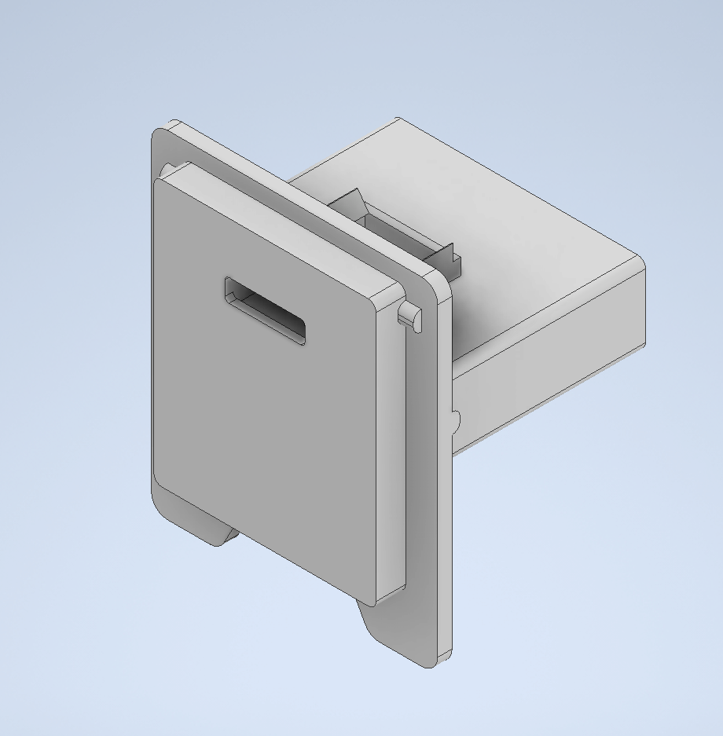

# PS2-USB-C-PD-mod

This is a USB-C power mod for the PS2 SCPH 50001

To Do:
  - Desolder 4 pin connector from PSU
  - ~~Design USB C trigger board mount that fits into power connector and switch slot.~~
  - ~~3d print trigger board mount~~
  - verify fit and adjust 3d design as needed

I am envisioning a mount that sits the trigger board on the ledge of the stock mount, this should be able to fit. Then the wires can be soldered onto the trigger board and go straight to the 4 pin connector. I see many designs that just solder wires directly to the PS2 mobo with no connector. I would like for this design to solder to the connector, not the mobo.

After printing the mount, the fit seems good. I have doubts about the trigger board staying in place, further testing required.

Parts:
  - Trigger board -
    - https://www.amazon.com/dp/B08LDJBN8P?ref=ppx_yo2ov_dt_b_product_details&th=1

Links:
 - USB C PD info
   - perhaps in the future I would like to design my own trigger board
   - https://resources.altium.com/p/add-usb-type-c-power-delivery-your-designs
   - https://octopart.com/search?q=cypd3177-24lqxq&currency=USD&specs=0
   - https://www.infineon.com/dgdl/Infineon-EZ-PD_BCR_Datasheet_USB_Type-C_Port_Controller_for_Power_Sinks-DataSheet-v03_00-EN.pdf?fileId=8ac78c8c7d0d8da4017d0ee7ce9d70ad
